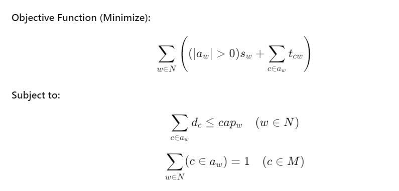

# Genetic Algorithm
Genetic Algorithm for Warehouse Location Problem

I developed a fast and powerful genetic algorithm to solve warehouse location problem.

---
# The Warehouse Location Problem

## Introduction

The Warehouse Location Problem (WLP) is a classic optimization problem. In this problem, a distribution company uses warehouses to provide goods to many different customers. The goal is to determine which warehouses will be the most cost-effective for serving the customers. Each warehouse has different costs and storage capabilities, which adds complexity to the problem.

## Assignment

You are tasked with designing an algorithm to solve the WLP. The problem can be mathematically formulated as follows:

- There are `N = 0 ... n−1` warehouses to choose from.
- There are `M = 0 ... m−1` customers that need to be served.
- Each warehouse `w ∈ N` has a capacity `cap_w` and a setup cost `s_w`.
- Each customer `c ∈ M` has a demand `d_c` and a travel cost `t_cw`, which depends on which warehouse serves them.

Lastly, all customers must be served by exactly one warehouse. Let `a_w` be a set variable denoting the customers assigned to warehouse `w`. The problem is to minimize the costs.

## Problem Formulation

The objective is to minimize the total cost, which consists of both the setup cost and the transportation cost from warehouses to customers. The problem can be formally expressed as:



This represents the Warehouse Location Problem (WLP), where:

- **`N`** is the set of warehouses.
- **`M`** is the set of customers.
- **`a_w`** is the set of customers assigned to warehouse **`w`**.
- **`s_w`** is the setup cost for warehouse **`w`**.
- **`t_cw`** is the transportation cost of customer **`c`** from warehouse **`w`**.
- **`d_c`** is the demand of customer **`c`**.
- **`cap_w`** is the capacity of warehouse **`w`**.

The goal is to minimize the total cost, subject to the constraints of warehouse capacities and customer assignments.

## Data Format

### Input Format

The input consists of `|N| + 2|M| + 1` lines. The first line contains two numbers, `|N|` followed by `|M|`. 

The first line is followed by `|N|` lines, where each line represents a warehouse capacity `cap_w` and setup cost `s_w`.

The last `2|M|` lines capture the customer information. Each customer block begins with a line containing one number, the customer’s demand `d_c`. The following line has `|N|` values, one for each warehouse. These values capture the cost to service that customer from each warehouse, `t_cw`.

### Output Format

The output has two lines:

1. The first line contains one value: *obj*. *obj* is the cost of the customer-warehouse assignment (i.e., the objective value) as a real number.
2. The second line is a list of `|M|` values in *N* – this represents the mapping of customers to warehouses.

### Input Example
```
3 4
100 100.123
100 100.456
500 100.789
50
100.1 200.2 2000.3
50
100.4 200.5 2000.6
75
200.7 100.8 2000.9
75
200.10 200.11 100.12
```
### Output Example
```
1002.888
1 1 0 2
```

This output represents the assignment of customers to warehouses:
```
- a_0 = {2}
- a_1 = {0, 1}
- a_2 = {3}
```
That is, customers 0 and 1 are assigned to warehouse 1, customer 2 is assigned to warehouse 0,
and customer 3 is assigned to warehouse 2
